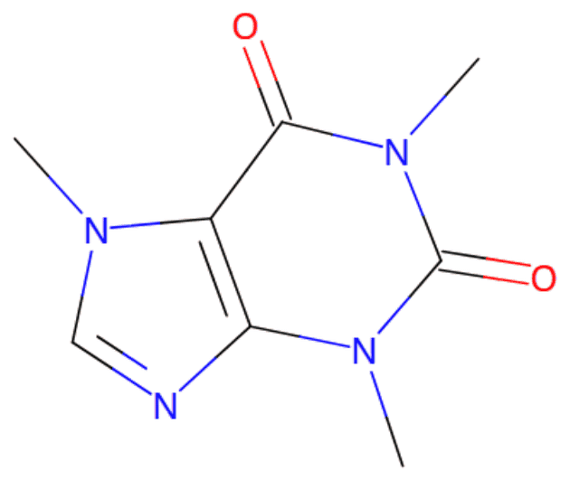
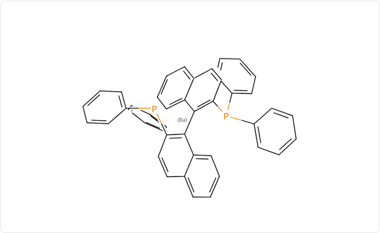
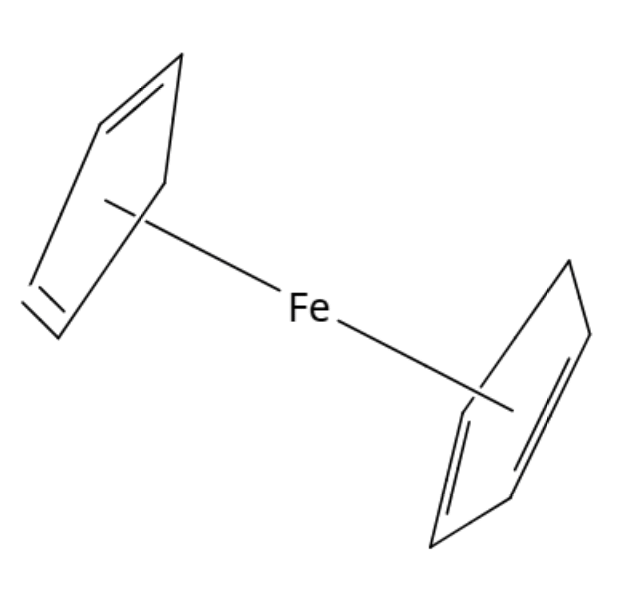
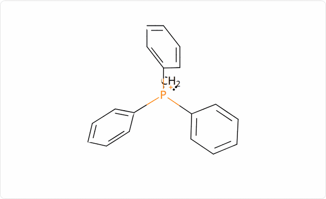
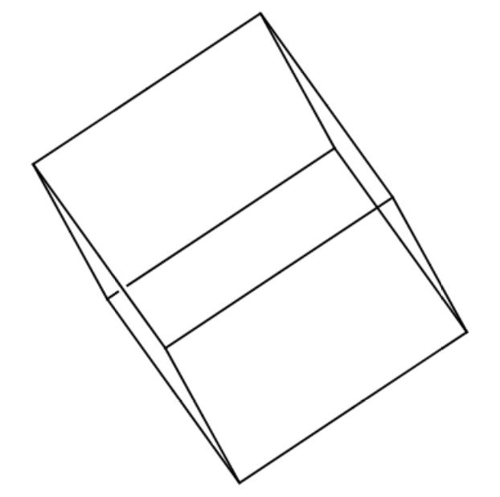
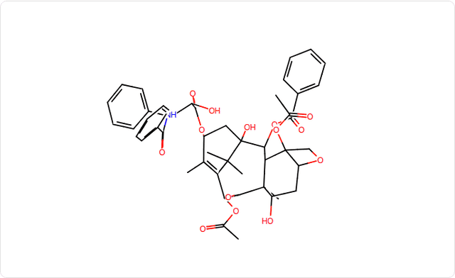
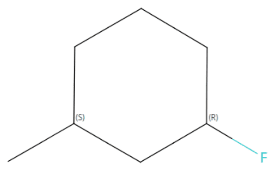
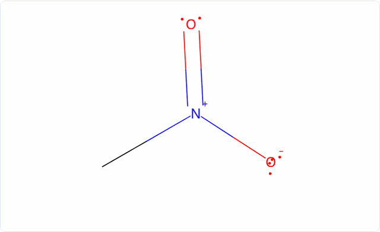

# MolTalk — chemistry tools for AI assistants


**Draw, verify and explore molecular structures with ChatGPT, Claude and other MCP clients.**

MolTalk is an [MCP](https://modelcontextprotocol.io) server that gives AI assistants real chemistry tools. They can
resolve compound names, validate structures, draw them inline, rotate them in 3D, analyse stereochemistry and export
files for ChemDraw and other software.

MolTalk does not trust structures invented by the model. Every structure is resolved and checked with
[RDKit](https://www.rdkit.org/), [OPSIN](https://github.com/dan2097/opsin) and a curated library of 22,000
compounds, and MolTalk **fails closed**: when a name is ambiguous, or stereochemistry cannot be verified, it says so
instead of drawing a guess.


[](LICENSE)

## See it in action

Every drawing can be grabbed and rotated in 3D, right in the chat. These animations were recorded from MolTalk's own
viewer ([how](docs/DEVELOPMENT.md#readme-animations)).

<table>
<tr>
<td width="50%" align="center"><br><b>Name → structure</b><br><sub>"Draw caffeine"</sub></td>
<td width="50%" align="center"><br><b>Axial stereochemistry</b><br><sub>(Ra)-BINAP, verified Ra/Sa</sub></td>
</tr>
<tr>
<td align="center"><br><b>Coordination chemistry</b><br><sub>Ferrocene, assembled from PubChem's loose pieces</sub></td>
<td align="center"><br><b>Electron structure</b><br><sub>Wittig ylide with lone pairs and formal charges</sub></td>
</tr>
<tr>
<td align="center"><br><b>Cages</b><br><sub>Cubane, drawn as a view of its 3D shape</sub></td>
<td align="center"><br><b>Complex natural products</b><br><sub>Paclitaxel (Taxol), 11 stereocentres</sub></td>
</tr>
<tr>
<td align="center"><br><b>R/S and E/Z</b><br><sub>(1R,3S)-1-fluoro-3-methylcyclohexane</sub></td>
<td align="center"><br><b>Lone pairs and charges</b><br><sub>Nitromethane</sub></td>
</tr>
</table>

## What MolTalk can do

- **Resolve names.** Trivial names ("caffeine", "Wilkinson's catalyst") come from a bundled library of 22,038
  compounds with about 200,000 names; systematic IUPAC names are read by OPSIN; PubChem is an optional fallback.
- **Draw clean structures.** 2D depictions with wedges and stereo labels, clean even for crowded molecules such as
  BINAP, Xantphos and porphyrins, shown inline in the chat.
- **Rotate in 3D.** Grab the drawing and it lifts into a 3D model that keeps the drawing's style, with lone pairs,
  charges and stereo labels attached to the geometry.
- **Analyse stereochemistry.** R/S and E/Z, atropisomers, allenes, spiro compounds and helicenes, with every
  descriptor checked against IUPAC's definitions, and specified, unspecified and arbitrary configurations kept apart.
- **Enumerate stereoisomers**, including meso forms and enantiomer pairs.
- **Show electrons.** Lewis-structure lone pairs, radicals and formal charges, in 2D and 3D.
- **Handle metal complexes.** Common catalysts and coordination compounds are assembled from database records and
  built in their proper geometry: square planar, tetrahedral, octahedral, sandwich.
- **Export.** ChemDraw (CDXML), MOL, SDF, PDB, XYZ and SMILES files, and SVG/PNG images of exactly what is on screen.
- **Search substructures** with SMARTS, chirality-aware.

## Why MolTalk?

Language models can write SMILES, but they misremember structures, drop stereocentres and invent plausible-looking
molecules. MolTalk changes what the assistant is allowed to claim:

- **Structures come from data, not memory.** Names are resolved by the library, OPSIN or PubChem, never generated.
- **Validation is explicit.** Every result reports where the structure came from (library, OPSIN, PubChem; with the
  PubChem CID) and its stereochemistry status: fully specified, partially specified or unspecified.
- **It fails closed.** Unknown names, ambiguous names ("lye": NaOH or KOH), names that do not say which stereoisomer
  ("glucose"), and stereodescriptors that the structure found cannot support ("(R)-BINAP" when the record has no
  axial stereo) are all refused, with the reason.
- **Labels are checked.** If the assistant draws a SMILES under a compound name, MolTalk checks the name against its
  library and flags a mismatch.
- **Descriptors are verified, not just computed.** Axial, allene and helical descriptors are measured independently on
  3D coordinates and must agree with RDKit before they are shown.

## Use MolTalk

The public server is

```text
https://moltalk-411294000488.us-central1.run.app/mcp
```

It is free to use and needs no account or API key. Request logs record which tool was called, never the molecule ([privacy policy](docs/PRIVACY.md), [terms](docs/TERMS.md), [support](docs/SUPPORT.md)).

**ChatGPT.** With developer mode on, create an app (connector) for the URL above with **No authentication**, or
upload the plugin package in [`plugin/`](plugin). Enable it in a chat and ask, for example, *"Using MolTalk, draw
aspirin."*

**Claude.** Settings → Connectors → Add custom connector, with the URL above. Then ask Claude to draw a molecule.

**Other MCP clients.** Connect to the URL with the streamable-HTTP transport, or run MolTalk locally over stdio (see
[Run it yourself](#run-it-yourself)). Clients without UI support receive the full data and can request the SVG.

## Examples

```text
Draw caffeine and identify its functional groups.
Draw (2R)-2-chloro-4-methylhexane and verify the stereochemistry.
Show the stereoisomers of BINAP.
Draw nitromethane with lone pairs.
Draw ferrocene.
Draw Wilkinson's catalyst and explain its geometry.
Draw cubane and replace four hydrogens with F, Cl, Br and I.
Export this molecule as a ChemDraw file.
```

More, with what to expect: [examples/](examples/README.md).

## Chemistry support

| Capability | Support |
|---|---|
| Name → structure | Bundled library (22,038 compounds), OPSIN for systematic names, optional PubChem fallback |
| Structure → IUPAC name and locants | For compounds in the library or PubChem, checked with OPSIN |
| 2D depiction | Yes, quality-checked; cages and helicenes drawn as views of their 3D shape |
| Interactive 3D | Yes: one force-field conformer aligned to the drawing |
| R/S and E/Z | Yes |
| Atropisomers (biaryl and C–N axes) | Yes, with verified Ra/Sa |
| Allenes and cumulenes | Yes, M/P (= Ra/Sa) |
| Spiro stereochemistry | Yes (descriptor withheld for Xabab spiro atoms) |
| Helicenes | Yes, P/M |
| Stereoisomer enumeration | Yes, with meso detection and enantiomer pairs |
| Lone pairs and formal charges | Yes, 2D and 3D |
| Radicals, carbenes, ylides | Supported; carbene spin state assumed by a stated rule |
| Coordination complexes | Common mononuclear complexes in standard geometries; porphyrins and corrins |
| Structure export | CDXML, MOL, SDF, PDB, XYZ, SMILES (CXSMILES where needed) |
| Image export | SVG, PNG |

Details: [docs/CHEMISTRY.md](docs/CHEMISTRY.md).

## Export

Ask for a file ("give me a ChemDraw file of that") and the viewer offers a download:

- **CDXML** opens directly in ChemDraw.
- **MOL** and **SDF** come in 2D (the drawing's layout) or 3D.
- **PDB** and **XYZ** come in 3D.
- **SMILES** is plain SMILES, or CXSMILES when coordinates are needed to state the stereochemistry.

When a format cannot carry some stereochemistry, the export says so instead of silently dropping it. The viewer's
**SVG** and **PNG** buttons save exactly what is on screen, cropped, with a transparent background.

## Known limitations

- 3D models are single calculated conformers for visualisation, not energy minima or measured structures.
- Trivial names outside the library need PubChem, which may be slow or busy from cloud servers.
- Hindered axes are detected by an ortho-substitution rule of thumb, not a rotation-barrier calculation.
- Multi-metal complexes, bridging ligands and η⁶-arene complexes are shown as stored. Geometry exceptions decided by
  ligand-field strength (NiCl₂(PPh₃)₂ is really tetrahedral) are not predicted.
- InChIKeys do not distinguish atropisomers.
- Up to 256 atoms per molecule.

The full list: [docs/LIMITATIONS.md](docs/LIMITATIONS.md).

## Run it yourself

```bash
git clone https://github.com/DomFico/moltalk.git && cd moltalk
python3 -m venv .venv && .venv/bin/pip install -e '.[dev]'
scripts/fetch-tools.sh                                  # OPSIN (needs Java 11+)
.venv/bin/moltalk                                        # stdio MCP server
.venv/bin/moltalk --transport streamable-http            # or http://127.0.0.1:8000/mcp
```

Or with Docker: `docker build -t moltalk . && docker run --rm -p 127.0.0.1:8000:8000 -e PORT=8000 moltalk`.

Deploying your own public instance on Cloud Run: [docs/DEPLOYMENT.md](docs/DEPLOYMENT.md). Development notes:
[docs/DEVELOPMENT.md](docs/DEVELOPMENT.md).

## Architecture

```text
ChatGPT / Claude / MCP client
      │  MCP over HTTPS
      ▼
Cloud Run: MolTalk server (FastMCP)
      │  worker processes with time and memory limits
      ├─ names:    bundled library → OPSIN → PubChem
      ├─ RDKit:    validation, analysis, stereochemistry, 2D layout, 3D models
      └─ export:   CDXML, MOL, SDF, PDB, XYZ, SMILES
      ▼
Viewer (MCP Apps UI in the chat): drawing, 3D rotation, lone pairs, image export
```

More: [docs/ARCHITECTURE.md](docs/ARCHITECTURE.md) · [docs/MCP_AND_UI.md](docs/MCP_AND_UI.md).

## Testing

The test suite, 350+ tests, covers name resolution and validation, stereochemistry (against IUPAC reference
examples), 2D layout quality, 3D geometry, metal complexes, exports, MCP behaviour and the viewer in a real browser.

```bash
.venv/bin/pip install -e '.[dev,ui-test]' && .venv/bin/pytest -q
```

See [docs/TESTING.md](docs/TESTING.md).

## Data sources

- [RDKit](https://www.rdkit.org/) for all cheminformatics.
- [OPSIN](https://github.com/dan2097/opsin) for reading systematic names.
- [PubChem](https://pubchem.ncbi.nlm.nih.gov/) and [Wikidata](https://www.wikidata.org/) for the bundled library,
  which is built from compounds that have a Wikipedia article, checked with RDKit and OPSIN.

See [docs/DATA_SOURCES.md](docs/DATA_SOURCES.md).

## License

MolTalk is open source under the [MIT License](LICENSE). It builds on RDKit (BSD 3-Clause) and the MCP Python SDK
(MIT); OPSIN (MIT) is downloaded at setup, not included. Chemical data comes from PubChem (see NCBI's
[policies](https://www.ncbi.nlm.nih.gov/home/about/policies/)) and Wikidata (CC0).
